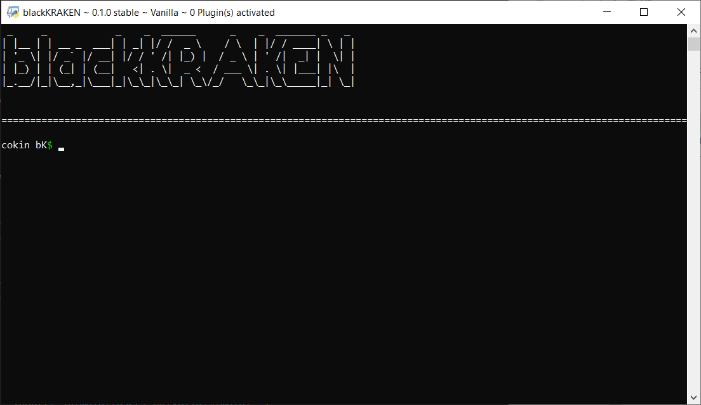

# 🐙 blackKRAKEN 🐙
``blackKRAKEN`` is a one-of-a-kind hacking console that supports plugins and modding!




# 📄 Documentation 📄
```txt

(wip, will be updated later)

```

# 📳 Modding & Plugins 📳

## About
Modding & Plugin support are one of the key features of ``blackKRAKEN``! I tried as hard as possible to make the code readable and easy to understand for easy modding, and plugins are as easy
as making a .bkp file and writing python code in it! I even made a plugin for debugging ``blackKRAKEN`` to make it easier for modmakers to debug their ``blackKRAKEN`` mod!
## Modding
To mod, you first may want to download the 'debug' plugin. To do so, follow these steps:
```txt
1. Open blackKRAKEN
2. Run the command 'bk inst debug'
3. Run the command 'bk act debug'
4. Done! Next time you open bK, or your modded version of bK, the debug plugin will be activated and you can debug your bK distribution.
```
Now, you can duplicate ``bK.py``, rename it to whatever you want, and mod it to your hearts content! Remember, uploading your own bK mods is heavily endorsed as long as credit is given to the
original project!
## Plugins
To make plugins, you can write python scripts, rename them to 'yourscriptname.bkp', and execute them within bK! Please keep in mind that only plugins made by Venom or Lunar Team are, by default,
the only plugins you can download in vanilla ``blackKRAKEN``. For more information, read the <a href="https://www.placeholder.website/">official bK documentation</a>! (Can be found in section above or on the <a href="https://www.placeholder.website/">blackKRAKEN website.</a>

# ⚠ Disclaimer, Terms of Use & License ⚠
This project is licensed under the GNU General Public License v3.0
```js
blackKRAKEN is made for educational purposes only and is not created for malicious purposes.
Any damage done with this software is not at the fault of Venom or at the fault of Lunar Team.
It is only at fault of the user. Please keep in mind that any malicious user plugins or mods are not
developed by Venom or Lunar Team, and as such, neither Venom nor Lunar Team will be held accountable.
```
## DISCLAIMER
THIS PROJECT IS STILL IN DEVELOPMENT. DO NOT EXPECT EVERYTHING TO BE PERFECTLY CODED AND TO WORK 100% PROPERLY.
